# Second task

- Automate a deploy

  - Do a build and deploy every time the code is merged to master.
  - Use github actions

  # Steps

- Created a new repo in github with the code
  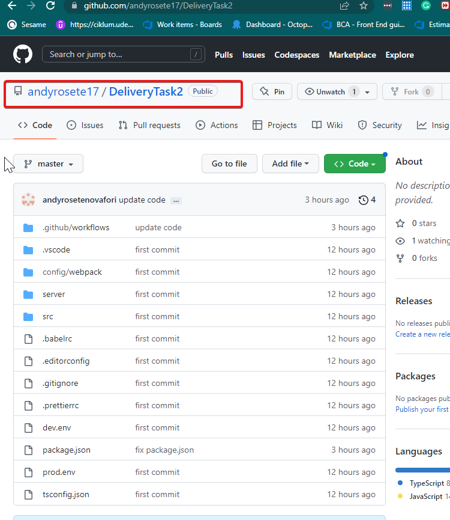
- Push the code
- Install the gh-pages library

```
$ npm i gh-pages --save-dev
```

with this library we will be able to deploy our code and execute the actions in github.

- Add deploy line in package.json

```
    "deploy": "gh-pages -d dist"
```

- We add later the continuos deployment file.
  - The file should be in the main route
    **.github/workflows/cd.yml**
  - The configuration of the file should look like this.

```
name: Continuous deployment workflow

on:
  push:
    branches:
      - master

jobs:
  cd:
    runs-on: ubuntu-latest
    steps:
    - name: Checkout repository
      uses: actions/checkout@v2
    - name: Install
      uses: npm install
    - name: Build
      uses: npm run build
    - name: Deploy
      uses: npm run deploy
```

- If the deployment fail, you might need to add the ssh credentials to the setup of the repo

  - First generate the private and public keys

  ```
  $ ssh-keygen -m PEM -t rsa -C "email@gmail.com"
  ```

  - With this you should have created 2 different files **id_rsa** and **id_rsa.pub**
  - Go then to settings => deployKeys
    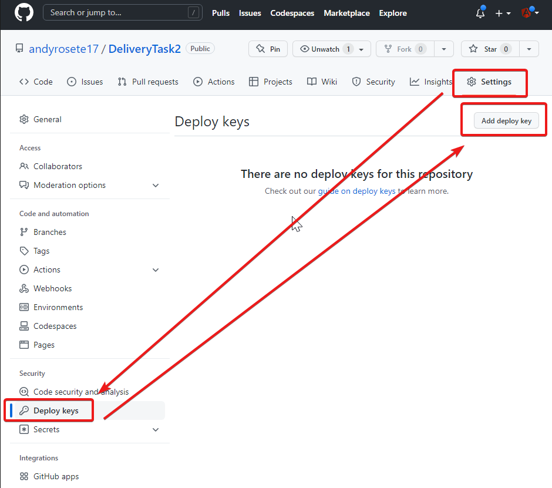

- We add later the public key
  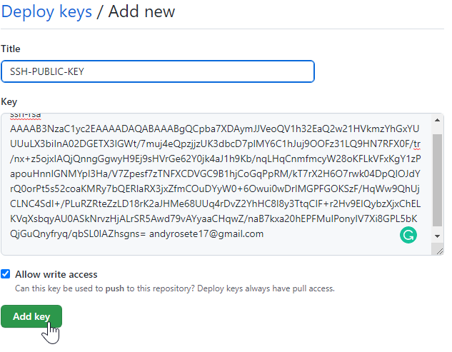

- We need to do the same with the private key
  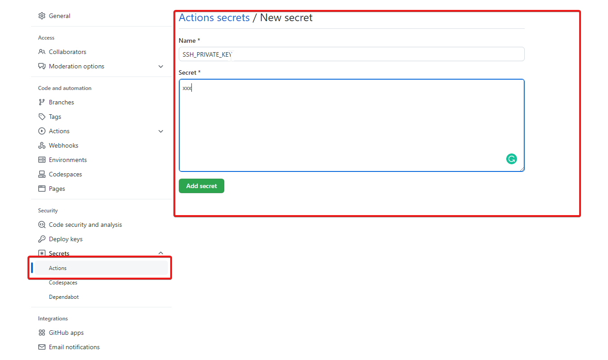

- **After you copied the values, remove both files generated**
- Its also needed to add the ssh configuration to the continuos integration file

```
  - name: Use SSH key
      run: |
        mkdir -p ~/.ssh/
        echo "${{secrets.SSH_PRIVATE_KEY}}" > ~/.ssh/id_rsa
        sudo chmod 600 ~/.ssh/id_rsa
    - name: Git Config
      run: |
        git config --global user.email "andyrosete17@gmail.com"
        git config --global user.name "andyrosete17"
    - name: Install
```

## `important` The email in the git config step must be the same used to generate the SSH key

- Its also important to add a new tag to the deploy step indicating the ssh url
  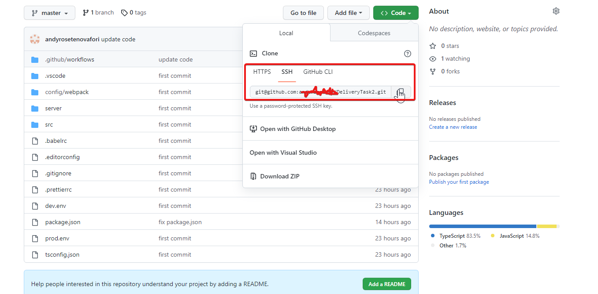

```
 - name: Deploy
      uses: npm run deploy -- -r git@github.com:andyrosete17/DeliveryTask2.git
```

# Check results
- If you click in action deployments, you should be able to see the page deployed.
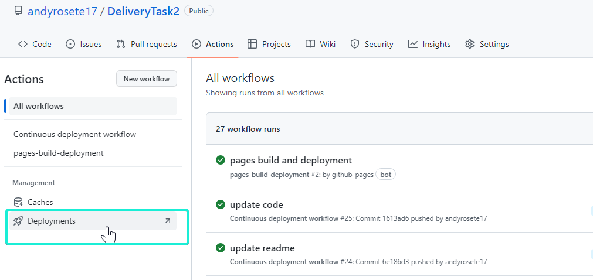
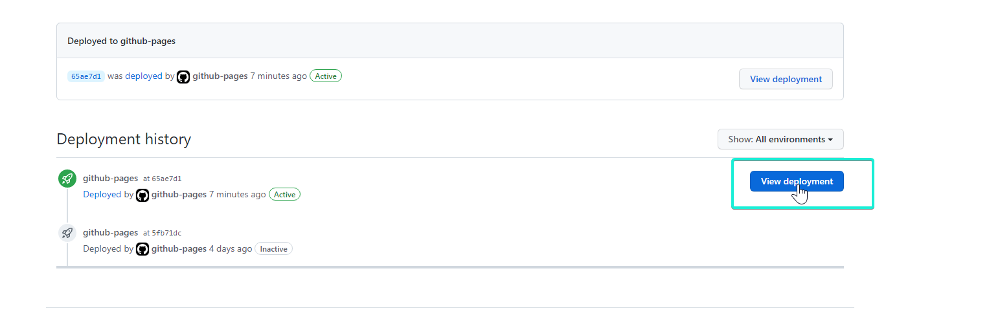

--------------------------------------------------------------------------------------------------

# Deployment using [Render](https://dashboard.render.com/)
- First step is created an account in the page.
- Once the account is created you should be able of navigating to a dashboard like this
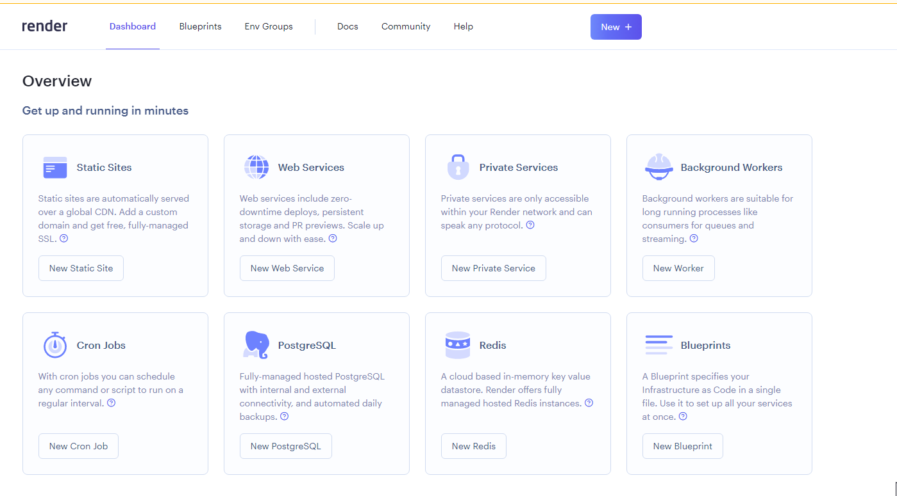
- For this project we can create an static sites project
  - then connect your repo with Render
- Select the correct repo to render
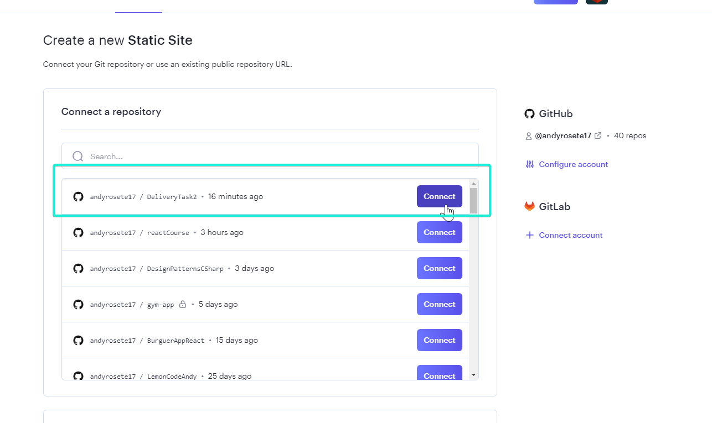
- Fill the site info
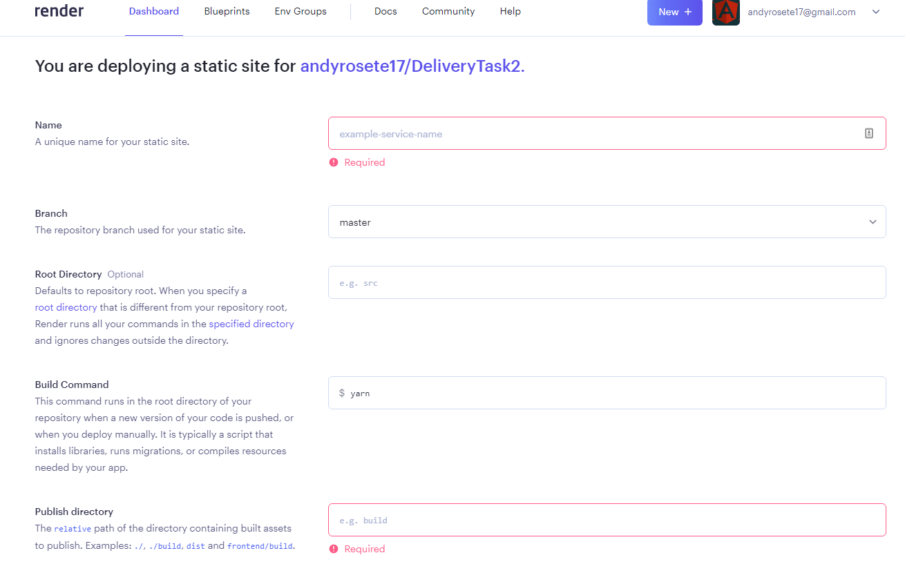

## `important` In the configuration the build command should be
```
npm run build:prod
```
## `important` The publish directory should be dist

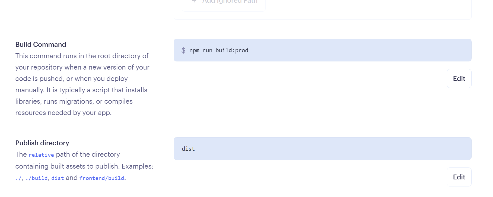

- As soon as its deployed you should be able to see this

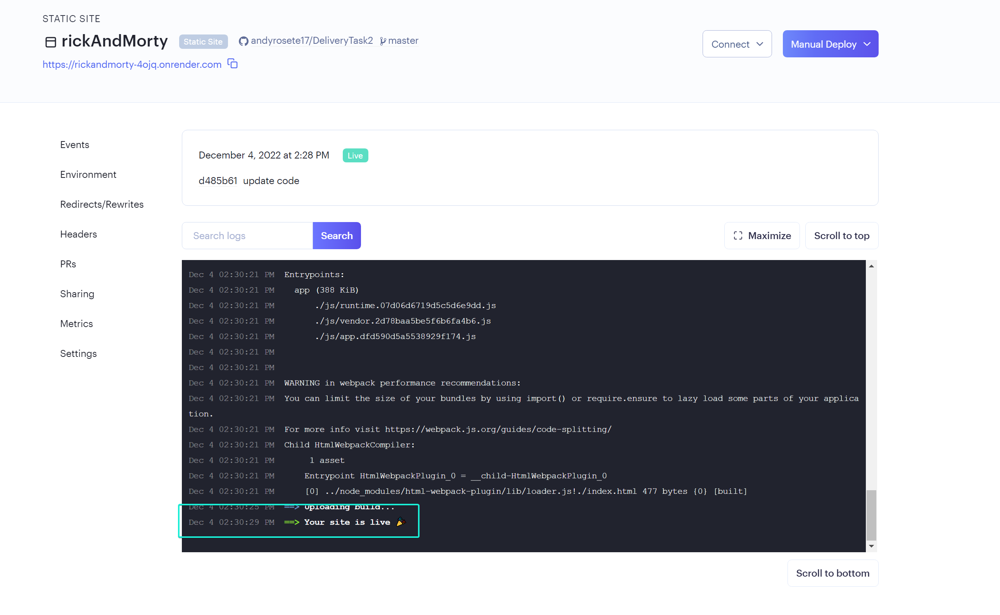
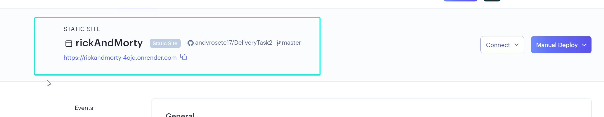

- And finally your web should be deployed
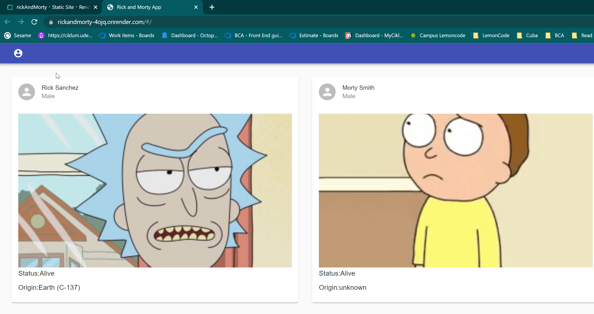
